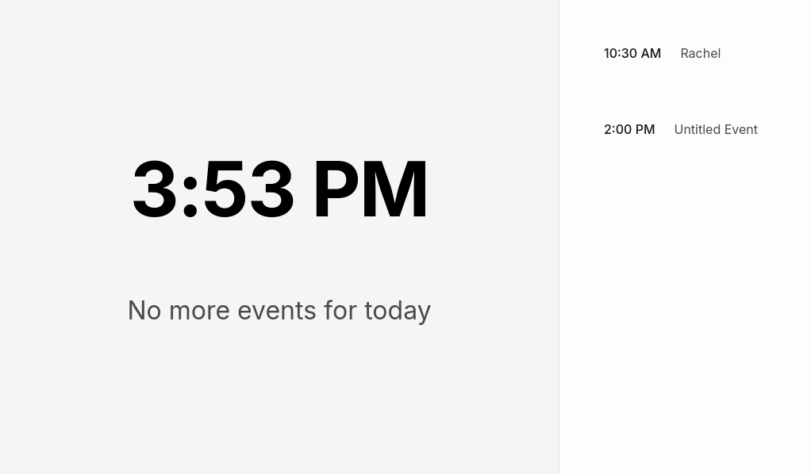
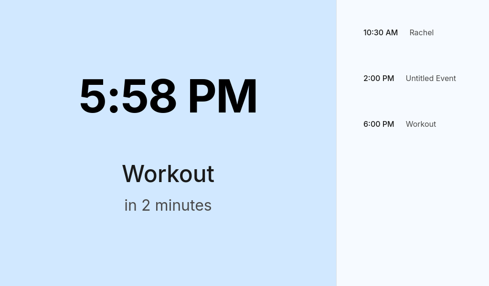

# ChromaCal
A color coded agenda for people with time-blindness, or anyone that wants to see their schedule at a glance.

Features:
- Syncs with Google Calendar
- Clearly displays today's agenda and the next event
- Color coded background to indicate how close the next event is
- Background color changes when the day is over and its time to go home





## Installation

### Download Pre-built Release
1. Go to the [Releases page](https://github.com/cookiecad/ChromaCal/releases)
2. Download the appropriate version for your system:
   - Windows: `ChromaCal-win32-x64.exe` (installer) or `ChromaCal-win32-x64.zip` (portable)
   - Linux: `chromacal_1.0.0_amd64.deb` (Debian/Ubuntu) or `chromacal-1.0.0.x86_64.rpm` (Fedora/RHEL)

### Build from Source
1. Clone the repository:
```bash
git clone https://github.com/cookiecad/ChromaCal.git
cd ChromaCal/chromacal
```

2. Install dependencies and start:
```bash
npm install
npm start
```

## Google Calendar Setup

In order to connect to your google calendar, you'll need to create a project in google cloud console and give it permissions for calendar.

#### 1. Set Up Google API Credentials

- **Create a Project in Google Cloud Console:**
  - Navigate to [Google Cloud Console](https://console.cloud.google.com/).
  - Create a new project or select an existing one.

- **Enable Google Calendar API:**
  - Go to **APIs & Services > Library**.
  - Search for **Google Calendar API** and enable it.

- **Create OAuth 2.0 Credentials:**
  - Go to **APIs & Services > Credentials**.
  - Click **Create Credentials > OAuth client ID**.
    - Choose **Desktop app** as the application type.
    - Download the `credentials.json` file.
    - Place it in the root folder of the project

#### 2. First Launch
1. Launch ChromaCal
2. You'll be prompted to authorize with Google Calendar
3. Follow the authorization steps in your browser
4. Once authorized, your calendar events will be displayed

## Development

### Creating a Release
1. Update version in `chromacal/package.json`
2. Create and push a new tag:
```bash
git tag v1.0.0  # Use appropriate version number
git push origin v1.0.0
```

The GitHub Action will automatically:
- Build the application for Windows and Linux
- Create installers and portable versions
- Upload the builds to the GitHub Release

Note: Windows users will see an "Unknown Publisher" warning since the application is not code signed. This is normal for open source applications.